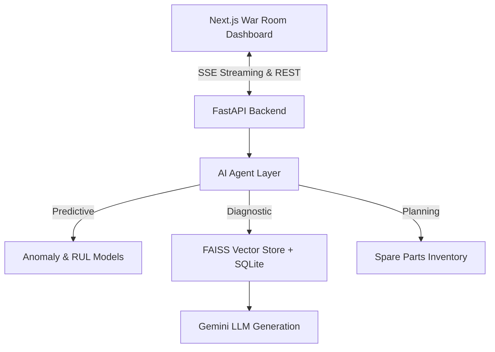

# SteelSense AI: Industrial Maintenance Copilot

**ForgeMind AI | Tata Steel AI Hackathon Submission**

SteelSense AI is an ultra-premium, dual-layer predictive maintenance and diagnostic copilot. Designed exclusively for heavy industrial environments, it moves beyond basic dashboarding to actually understand the **business and financial impact** of cascading equipment failures.

## 🚀 Key Features

- **Dual-Layer RAG Engine**: Combines vector similarity (FAISS) with structured metadata (SQLite) to retrieve precise equipment manuals, SOPs, and past maintenance logs.
- **Agentic Maintenance Brain**: An intent-driven AI router powered by LangChain that detects if the user needs a predictive diagnosis, root cause analysis, or procurement planning.
- **Predictive ML Engines**: Native integration with Anomaly Detection and Remaining Useful Life (RUL) estimation algorithms to stream live degradation metrics.
- **Dark Mode War Room**: A responsive Next.js frontend with data-dense glassmorphism visuals, featuring fluid Framer Motion transitions.

## 🏗️ Architecture

### Modular Backend Design
- `/routers`: Dedicated REST endpoints for Alerts, Equipment, Diagnosis, Chat, Spare Parts, Reports, and Knowledge.
- `/agents`: Agentic workflows separated into `chat_agent`, `diagnostic_agent`, `predictive_agent`, `report_agent`, and `knowledge_agent`.
- `/models & /schemas`: Robust Pydantic and SQLAlchemy ORM layer handling SQL data relationships.

## 🛠️ Quick Start & Setup

### Prerequisites
- Python 3.10+
- Node.js 18+
- Gemini API Key

### Backend Setup
1. `cd backend`
2. Create virtual environment: `python -m venv venv` and activate it
3. Install dependencies: `pip install -r requirements.txt`
4. Create a `.env` file and add your key: `GEMINI_API_KEY=your_key_here`
5. Generate synthetic data and index it:
   - `python app/main.py` (The database is automatically seeded upon first run)
6. Start the server: `uvicorn app.main:app --reload --port 8001`

### Frontend Setup
1. `cd frontend`
2. Install dependencies: `npm install`
3. Start development server: `npm run dev`
4. Open `http://localhost:3000`
