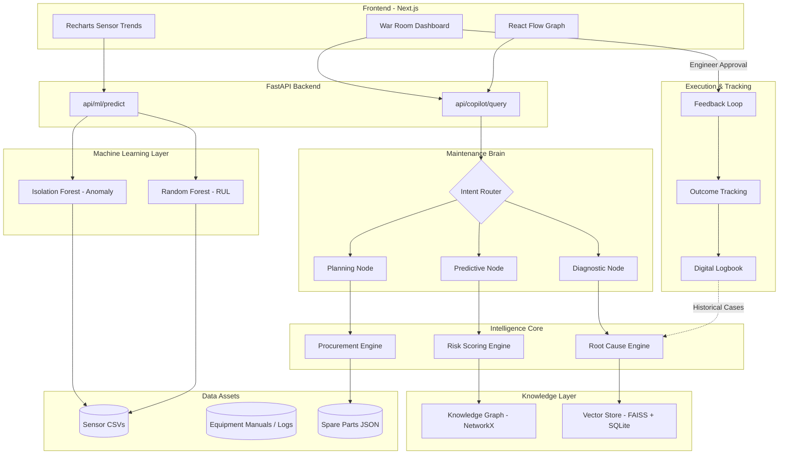

# System Architecture

## Architecture Diagram

## Component Overview

1. **Frontend**: Next.js App Router with Tailwind CSS v4. Uses `@xyflow/react` for visual failure propagation maps, ensuring highly interactive presentations.
2. **Maintenance Brain**: LangGraph state-machine orchestrating LLM tool-calling. Ensures deterministic routing without infinite LLM loops.
3. **Dual-Layer Retrieval**:
   - **FAISS**: Dense vector search for semantic matching.
   - **SQLite**: Hard metadata pre-filtering (by manual type, asset ID) to prevent hallucinated references.
4. **Knowledge Graph**: Seeded topology of the factory floor using `NetworkX`. Evaluates the cumulative hourly downtime cost of cascading failures.
5. **ML Layer**: Replaces black-box thresholding with statistical modeling. `IsolationForest` handles unsupervised anomaly detection on healthy baselines, while `RandomForest` performs regression to estimate remaining useful life.
